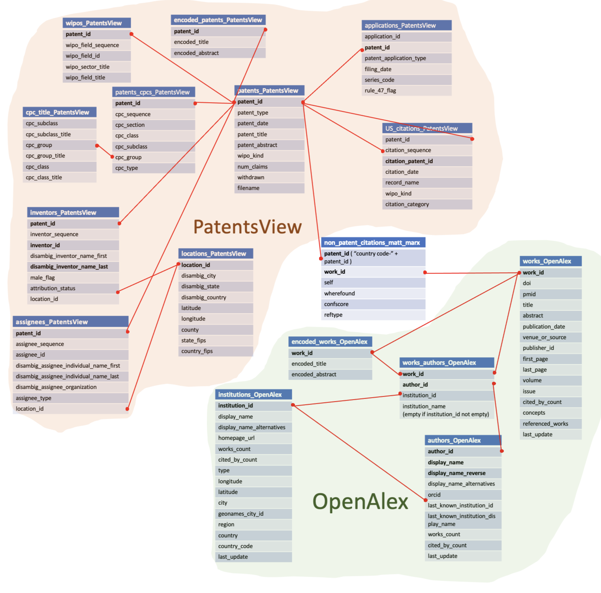

# Scientist-Inventor dataset

This reposistory provides the code to link worldwide scientists (disambiguated in the OpenAlex database) to inventors of US patents (disambiguated in the PatentsView database). This code creates the scientist-inventor database, publicly available at [Zenodo](https://zenodo.org/records/11374125). 
You can refer to our paper "Early patents, lasting impact: Pasteur’s Quadrant Researchers bring novelty and impact to science and technology" for more details: "paper link". 
This github provides the code to generate the statistics, tables and figures describe in the paper. 

The order in which the codes should be run is the following: 
1. download_OpenAlex and download_PatentsView
2. text_encoding
3. train_the_model
4. run_SI_dataset
5. validation
6. novelty_measure (can also be run after or before 4). 
7. data_description
8. regressions
9. reviews

* The folders "download_OpenAlex" and "download_PatentsView" provide the code to download the worldwide science publication database OpenAlex and the US patent database PatentsView.
* The folder "text_encoding" provides the code to encode the paper's and patent's titles and abstracts with the open source pre-trained model "all-MiniLM-L6-v2".
* The folder "train_the_model" provides the code to train the predictive model used to identify papers and patents written by the same individual. It also provdes the code to create the training set, compare different classification models, and create the figures in both the paper and the supplement appendix. 
* The folder "run_SI_dataset" provides the code to link the full worldwide scientists' database to the US inventors' database. 
* The folder "validation" provides the code used to validate the SI dataset against GoogleScholar and against the patent to paper citations. The manual and automated files generated to validate the SI dataset against GoogleScholar can be downloaded in this folder, as well as the code to generate figure SX.
* The folder "novelty_measure" provides the code to generate our novelty measure. The distribution of the paper and patent novelty measure can be found in this folder.
* The folder "data_description" provides the code to generate the descriptive figures and statitstics about the SI dataset. It provides the code to query all relevant information on SI's papers and patents (dates, institutions, geographic data, field, cpcs, type of affiliations...), the figures SX to SX, as well as main paper figures.
* The folder "regressions" provides the code to generate the files used in most of the regressions (regressions at the document level and career level), as well as the do files to run most of the regressions and the regression results.
* The folder "reviews" provides the code to generate the files used in the remaining regressions (regressions where we match a PQR with a non PQR) added as part of the review process.

Note that (almost) all the code requires a username and password to query a postgres database (created based on the code provided in the folders "download_OpenAlex" and "download_PatentsView"). The schema of the postgres database used in the provided code is described in the [database_schema](database_schema.png).

Note that the OpenAlex and PatentsView datasets were retrieved (using the code in the GitHub repository in 2023. Although PatentsView maintains a standard format, such that the code will retrieve identically-named files from AWS that moreover have the same structure, we cannot guarantee the same for OpenAlex as the formatting and deliver of its ``snapshot'' have evolved over time. We therefore provide the snapshot of OpenAlex that we downloaded in 2023, and which is compatible with the code in the GitHub repository. It should  suffice to run the code at the point of uncompressing the snapshot as we cannot guarantee---and in fact do not expect---that our code for retrieving and uncompressing the OpenAlex snapshot will function on the current website. 

The OpenAlex snapshot, from 2023-08-18, is nearly one-third of a terabyte in size and therefore is allocated among eight Zenodo repositories, each of which contains a single .tar file, that can be found in the supplement of the paper.

Below are the database schema: 

