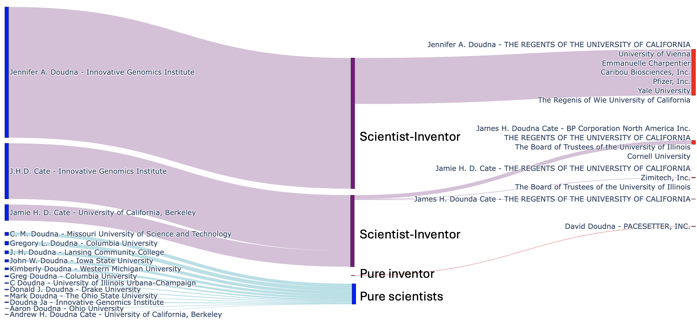

# This section provides the main statistics and descriptive figures and analysis of the SI dataset

This section requires the full data (OpenAlex + PatentsView) loaded into a Postgres database (username and password are required to run the codes, please see folder download_OpenAlex and download_PatentsView) as well as the patent and paper titles and abstracted encoded with a pre-trained model (please see folder text_encoding). It also requires the SI dataset to be generated(please see folder run_SI_dataset). 

* The notebook "Doudna_Sankey.ipynb" provides the code to generate a sankey diagram (as illustrated below) showing the SI / pure inventors / pure scientists with a given name. This notebook provides the code to generate the figure S1 (figures/doudna_sankey_05_all.png).

* The python file "paper_data.py" provides the code to query metadata on SI papers (papers published, dates, concepts and institutions). The data is stored as a json dictionary in the folder "data".
* The python file "patent_data.py" provides the code to query metadata on SI patents (patents granted, dates, cpcs, inventor's gender, assignees and inventor and assignee geographic location). The data is stored as a json dictionary in the folder "data".
* The python file "patent_assignee_type.py" provides the code to query the types of assignees (according to Patstat classification) of SI's patents. The data is stored as a tsv file in the folder "data".

* The notebook "Descriptive_figures_SIs.ipynb" provides the code to generate figure 1 and figures S13 to S22 (stored in the folder "data"). Note that the 3 python files need to be run and the corresponding data needs to be stored before running this notebook. 
    * The first section provides the code to load the data and create files storing metadata on the SIs (active_inventors, active_authors, dic_clusters_mag.json, dic_types_institutions_mag.json, dic_concepts_cpcs_mag.json, gatekeepers_years_mag.json).
    * The second section provides the code to generate the figures. 

* The folder "figures" stores the figures describing the SI dataset. The figures are generated using the two jupyter nobebook "Doudna_Sankey.ipynb" and "Descriptive_figures_SIs.ipynb". 

* The folder "data" stores the data related to the SIs:
    * metadata on the SI papers (dic_papers and dic_papers_missing) and metadata on the SI patents (dic_patents and dic_patents_missing) generated using "paper_data.py" and "patent_data.py". 
    * data on the SI active years (active_inventors, active_authors), metadata on each SI (dic_clusters_mag.json, dic_types_institutions_mag.json, dic_concepts_cpcs_mag.json, gatekeepers_years_mag.json) generated using "Descriptive_figures_SIs.ipynb". 
    * GDP data (from https://www.bea.gov/data/gdp/gdp-county-metro-and-other-areas) and county shapes (https://public.opendatasoft.com/explore/dataset/us-county-boundaries/table/).
    * OpenAlex institutions (from OpenAlex folder)
      
* Note that running this section requires access to a postgres database. The database username and password are stored in the text file "database.txt"

Example of SIs / pure scientists / pure inventors named "Doudna" : 