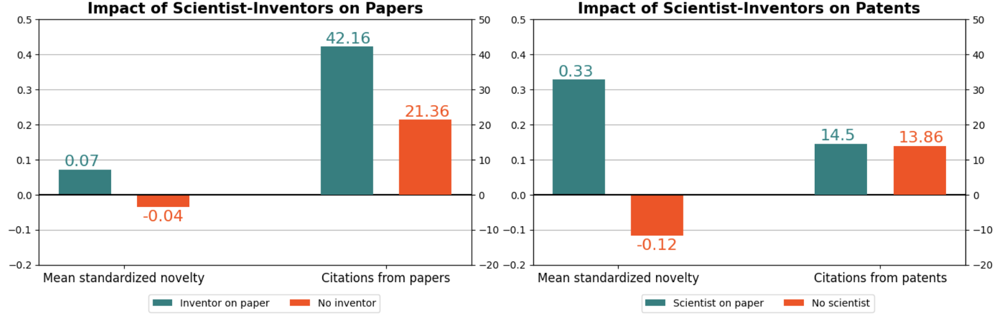

# This folder describes how the regressions are done. 

We describe the statistical correlation between being an SI (people publishing and patenting) and the number of citations and the novelty (described in folder novelty_measure) of the SI papers and patents in comparison with pure scientists and pure inventors. 

This section requires the OpenAlex data to be loaded into a Postgres database (username and password are required to run the codes, please see folder download_OpenAlex) as well as PatentsView flat files (please see folder download_PatentsView).  It also requires the novelty measure (please see folder novelty_measure), and the active years of the SIs and the patent assignee types (please see folder "data_description").

* The notebook "regression_file" provides the code to generate the files used in the stata regressions. For the papers, the code first queries all papers published from 1980 to 2022 affiliated with at least US institution. Then, the first regression file is generated (document level regression, table X). It includes all the queried papers as well as their cites, novelty, dates, institutions (one random), concept (one random), number of pure scientists, number of SIs, indicator for breakthroughs (being in the top 5% top cited papers). Finally, the second regression is generated (career level regression, table X). It contains every year each SI  ever published, as well as their number of works, average novelty, number of breakthrough (top 5% top cited papers), sum of cites, field of study. The second section provides the code to generate similar files for patents. The last second provides the code to generate plots and descriptive statistics on the regression files. It provides the code to generate figure 2. The files can generate similar regression files for different confidence by changing the confidence threshold in the code. 
* The do files "regressions_05.do" provides the code to run the document level regression in stata for the high confidence SI dataset. Similar regressions can be run for a different confidence threshold using this do file by changing the input file. 
* The do file "regressions_by_year_05.do" provides the code to run the career level regression in stata for the high confidence SI dataset. Similar regressions can be run for a different confidence threshold using this do file by changing the input file.
* The files "level1_conf05_5percent.tex" and "level1_conf05_5percent.tex" provide the results of the document level regressions for the high and low thresholds. 
* The files "regressions_by_year_05.tex" and "regressions_by_year_02.tex" provide the results of the career level regressions for the high and low thresholds.

Note that different levels of field controls can be used as robustness checks in the regressions (more or less granular concepts or cpcs). 

Below, the main figure and results of this section: 

