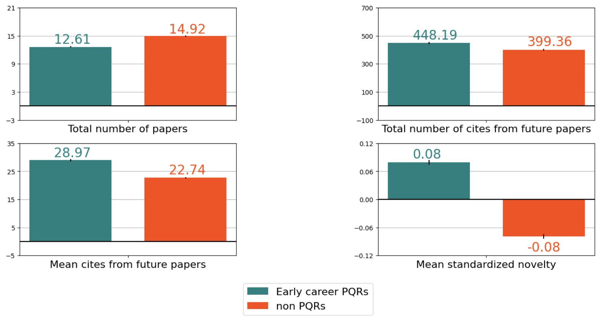

# This folder describes the additional code that was required as part of the review process.

We matched PQRs (individuals who patented and published during their career) which non PQRs (here, individuals who did not patented during their career) and compared their number of papers published, their number of cites and average citations received over their career.

This section requires the OpenAlex data to be loaded into a Postgres database (username and password are required to run the codes, please see folder download_OpenAlex) as well as PatentsView flat files (please see folder download_PatentsView). It also requires the novelty measure (please see folder novelty_measure). 

* The notebook "matching_PQRs" provides the code to link PQRs with non PQRs, as well as the code to generate the figure 2 of the main paper. The first section describes the code to match the PQRs with the non PQRs. The PQRs are matched on the year of their first paper, institution of their first paper, field and number of papers published in the 5 first years of their career (two files are created here: exact match or PQR with one fewer paper). The file is limited to the PQRs who patented in the 10 first years of their career and for which the institution is not missing. The second section provides the code plot figure 2 of the main paper, 

Note that different levels of confidence threshold can be used as robustness checks in the regressions.

Below, the main figure and results of this section: 

