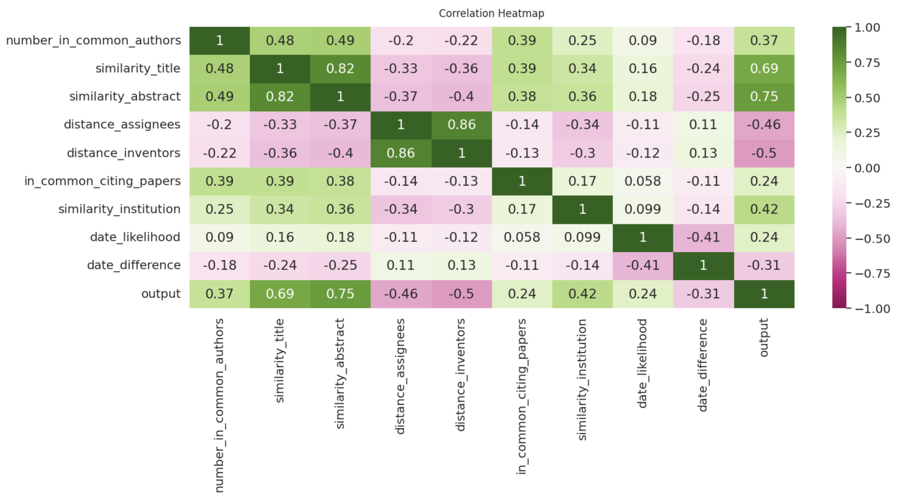

# This folder describes how to train the classification model which predicts if a paper and a patent are written by the same individual. 

Here, we provide the code to create the training set (from a set of patent citing papers, extended to more divers papers using the ORCID), as well as the code to train the classification model and to evaluate and save the random forest. 

This section requires to have the full data (OpenAlex + PatentsView) loaded in a Postgres database (username and password are required to run the codes, please see folder download_OpenAlex and download_PatentsView). It also requires to have the patent and paper titles and abstracted encoded with a pre-trained model (please see folder text_encoding). 

* the jupyter notebook "self_citations.ipynb" provides the code of the whole training process. The first section provides the code to query and identify patents and papers written by the same individual, using patent to paper citations. The second section provides the code to extend this dataset to more diverse papers, by including papers corresponding to the same ORCID, and therefore also written by the same individual. The thrid section provides the code to create the positive instances of the training set from this extended dataset, as well as the code to create the negative instances of the training set. The last section provides the code to train, evaluate and save the random forest, train on the training set created in the previous sections. The last section also the code to generate the figures SX to SX. 
* the figures SX to SX can be found and downloaded in this folder.

Below the correlation matrix of the features used in the random forest: 

