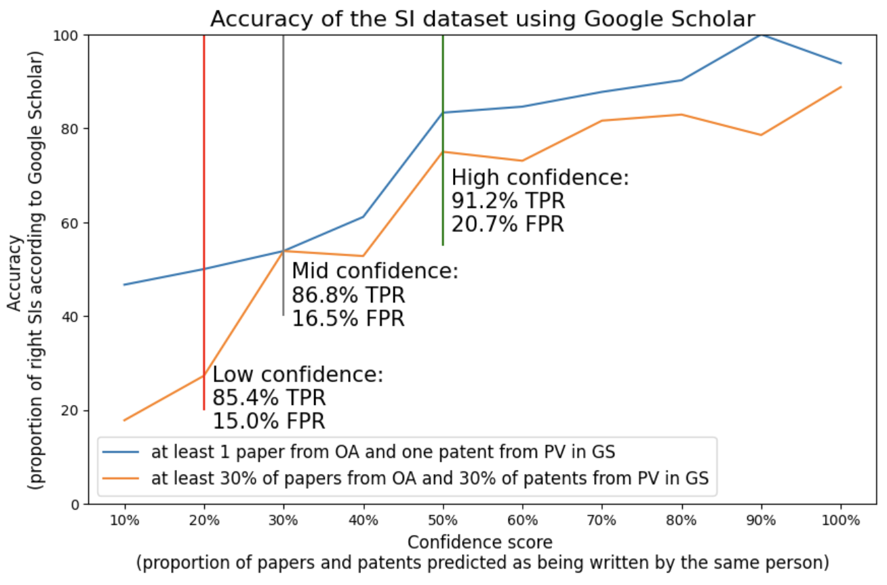

# This section describes the process to validate the SI dataset against Google Scholar (lumping errors) and using patent to paper citations (splitting errors)

We validate the SI dataset in two distinct ways: 
* We use Google Scholar, which hosts publications and often patents published by scientists, to quantify the proportion of lumping in our dataset. We match a sample of SI extracted randomly from our dataset with Google Scholar profiles. Then, we compare the papers and patents listed in Google Scholar with the SI works from OpenAlex and the SI patents from PatentsView. 
* We use M. Marx & A. Fuegi dataset, providing patents citing papers, to quantify the proportion of splitting in our dataset. We select a random sample of patents citing papers with author's and inventor's names overlapping, and assume that these papers and patents are written by the same individual, and therefore, that the individual is an SI. Then, we calculate the proportion of these SIs that are in our dataset.

This section requires the full data (OpenAlex + PatentsView) to be loaded in a Postgres database (username and password are required to run the codes, please see folder download_OpenAlex and download_PatentsView) as well as the patent and paper titles and abstracted to be encoded with a pre-trained model (please see folder text_encoding). It also requires the SI dataset to be generated (please see folder run_SI_dataset). 

* The notebook "Validation.ipynb" provides the code to quantify the accuracy of the SI dataset. This notebook provides the code to generate figure S12. 
    * The first section provides the code to conduct the manual validation of the SI dataset (lumping errors). First, it provides the code to 1) manually select the Google Scholar profile corresponding to a given Berkeley faculty, 2) retrieve the papers from OpenAlex and patents from PatentsView corresponding to the SI, and 3) generate the files to be manually inspected (assess if a document found on Google Scholar and a paper or a patent are the same document).
    * The second section provides the code to conduct the automated validation of the SI dataset (lumping errors). First, the code to compare OpenAlex papers and PatentsView patents against Google Scholar is provided. Then, the code to compare the patent's co-inventors with Google Scholar co-authors is provided.
    * The section "Validation using patents citing papers with name overlap" provides the code to quantify the splitting of the SI dataset. It provides the code to select a random sample of patents citing papers with author's and inventor's names overlapping and then, to calculate the proportion of these SIs that are in the SI dataset.
    * The last section provides the code to plot the evaluation metrics of the SI dataset in terms of its confidence metric.

* The flat file "google_scholar_manual_validation.tsv" provides the results of the manual validation of 10 Berkeley faculty SIs against Google Scholar.
* The intermediate files used for the manual validation (excel files filled out manually and indicating if OpenAlex papers or PatentsView patents are found in Google Scholar or vice versa) can be found in the folder "manual_validation_GoogleScholar"
* The flat file "google_scholar_automated_validation.tsv" provides the results of the automated validation of 390 random SIs against Google Scholar.
* The intermediate files used for the automated validation (Google Scholar profiles and their corresponding works, comparison of Google Scholar co-authors and Google Scholar co-inventors) can be found in the folder "automated_validation_GoogleScholar"

* The figure "validation_conf_TPR_FPR.png" illustrates the proportion of lumping / splitting of the SI dataset in terms of its confidence metric.

* Note that running this section requires access to a postgres database. The database username and password are stored in the text file "database.txt"

Evaluation of the SI dataset: 
